<!docktype html>
  <html>

  <head>
    <title> HAPPY BIRTHDAY GAURAV </title>
    
  </head>

  <body>

    <h1> HAPPY BIRTHDAY MERE BHAI </h1>
    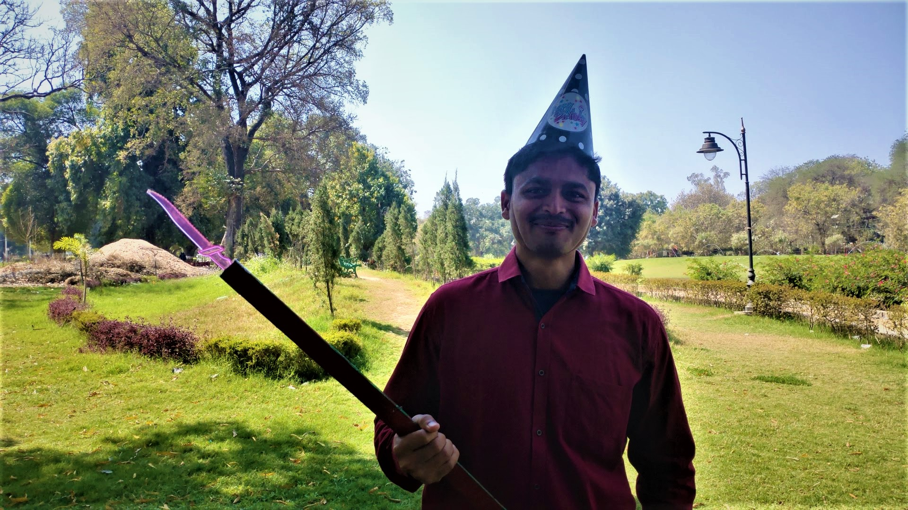

    <h1> I think when we met first time </h1>
    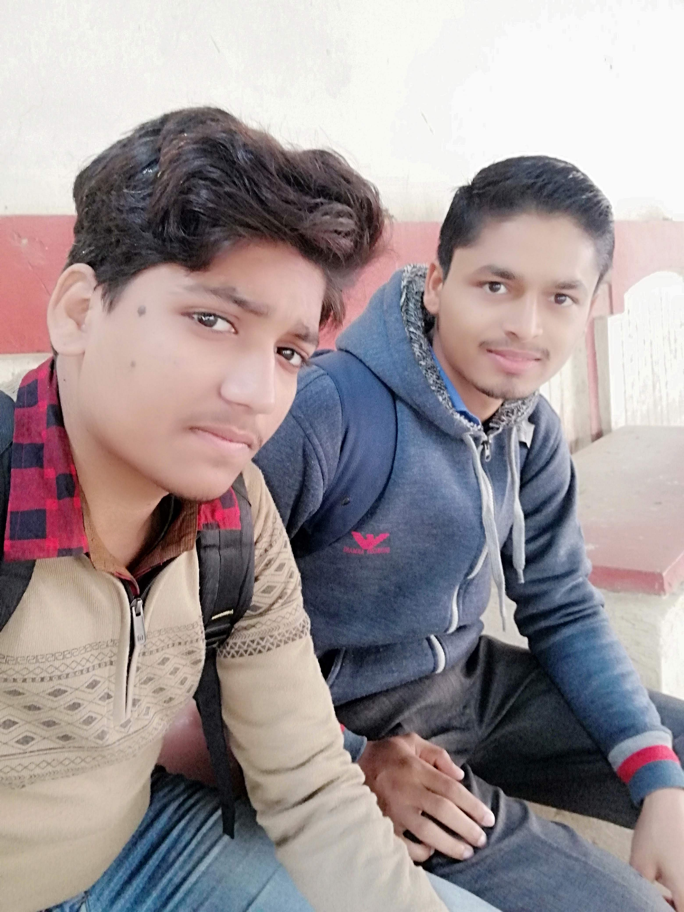
    <h1> COAT3.0 </h1>
    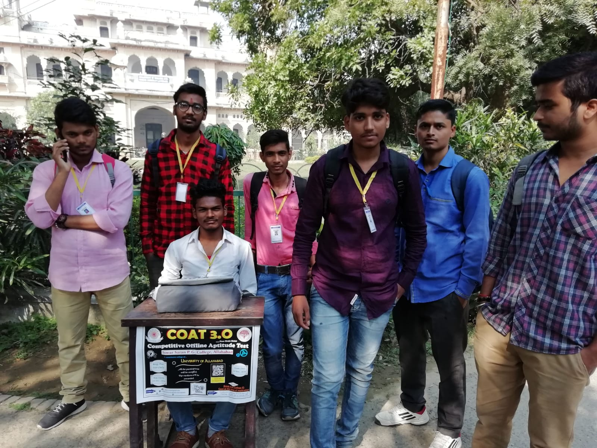

    
 aapki dosti ki ek nazar chhahiye

    
 dil hai beghar use ek ghar chhahiye

    
 bas yuhin sath chalte raho ye dost

    
 ye dosti hamen umra bhar chhahiye

    <h1> P.O.BOX </h1>
    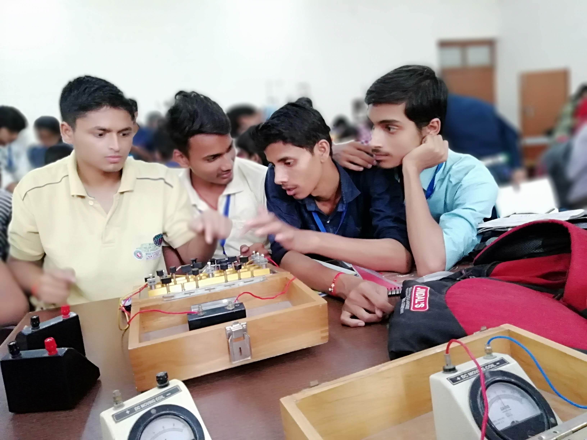
    <h1> tractor </h1>
    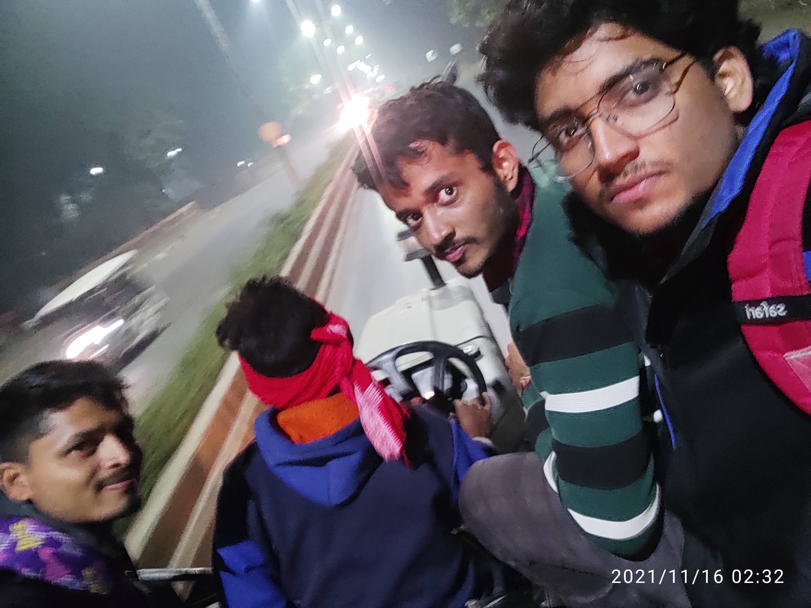
    <h1> ETERNAL</h1>
    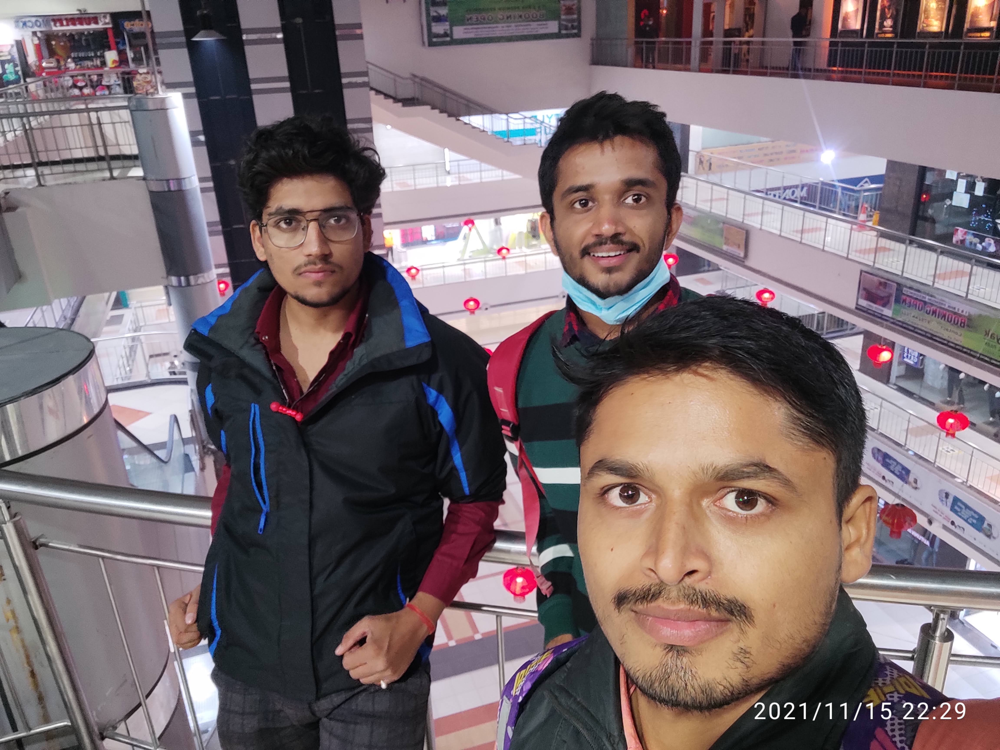
    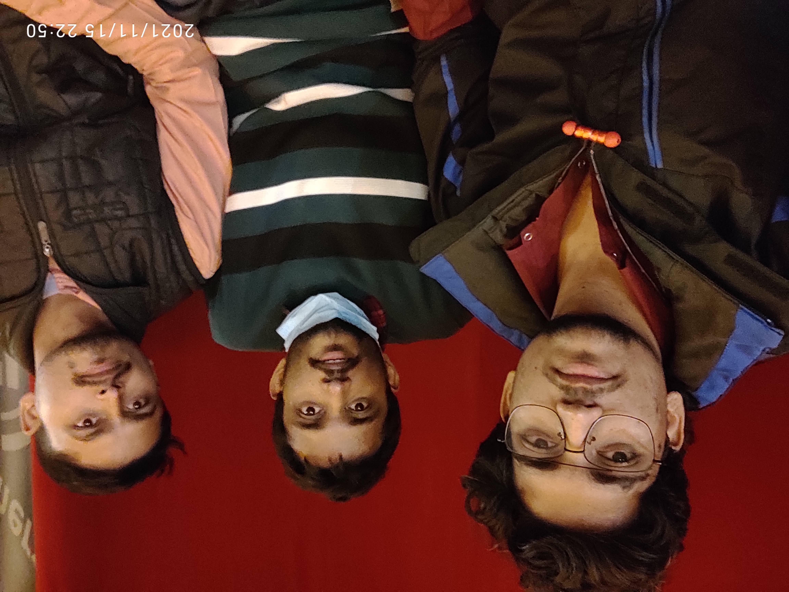
    <h1> Result day </h1>
    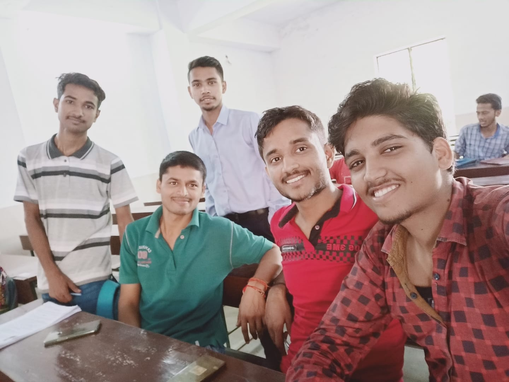
    <h1> OUR 5AM CLUB </h1>
    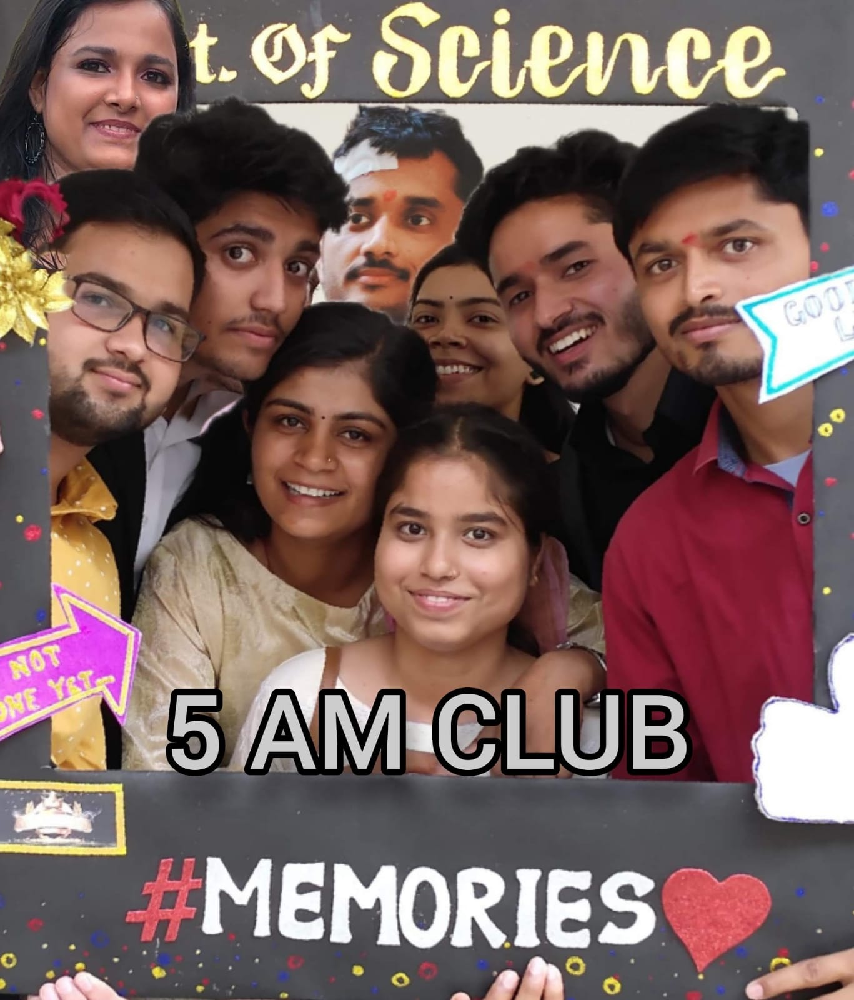
    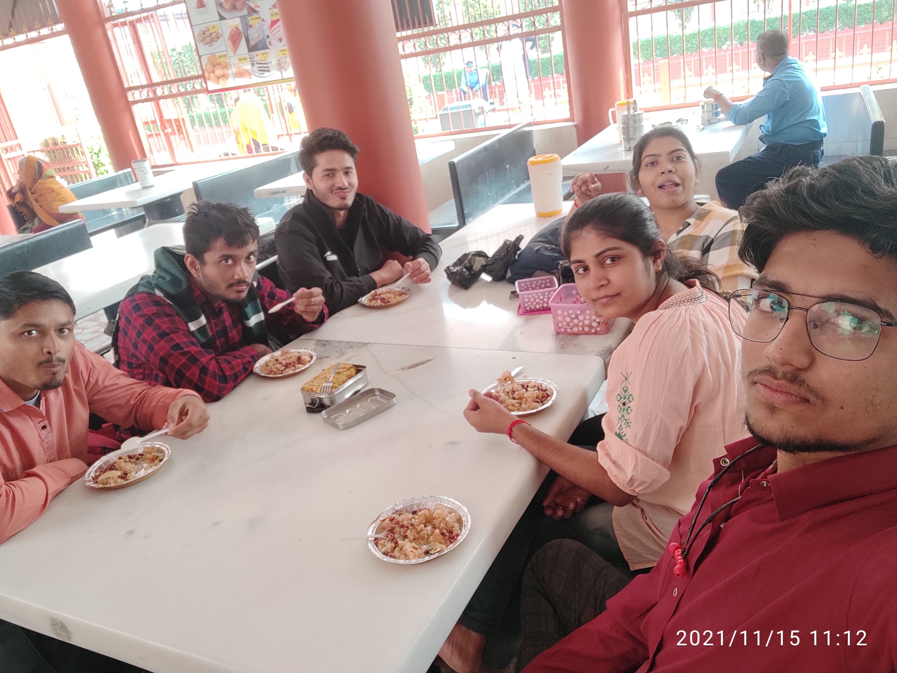

    <h1> CREATIVITY </h1>
    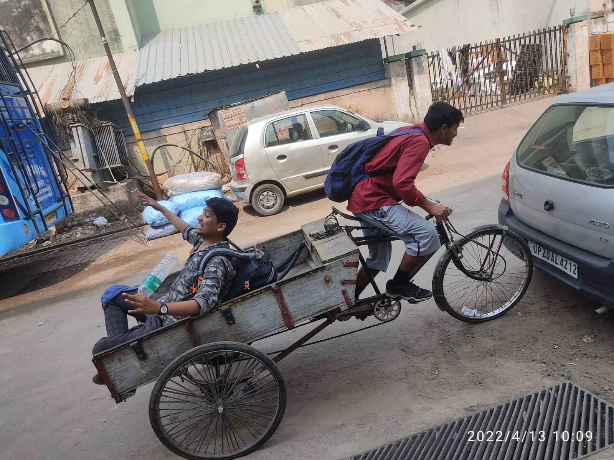
    
    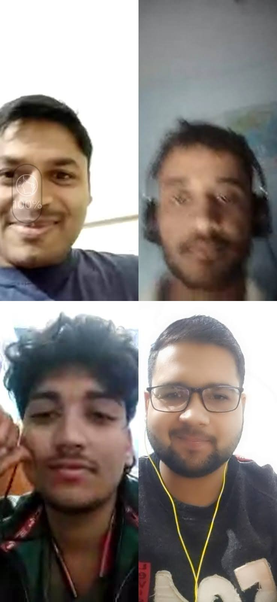

    
 ek jaise dost sare nahi hote 

    
kuch humare hokar bhi humare nahi hote

    
aapse dosti karne ke baad mahsoos hua 

    
 kaun kahta hai jameen par  tare nahi hote 

  </body>

  </html>